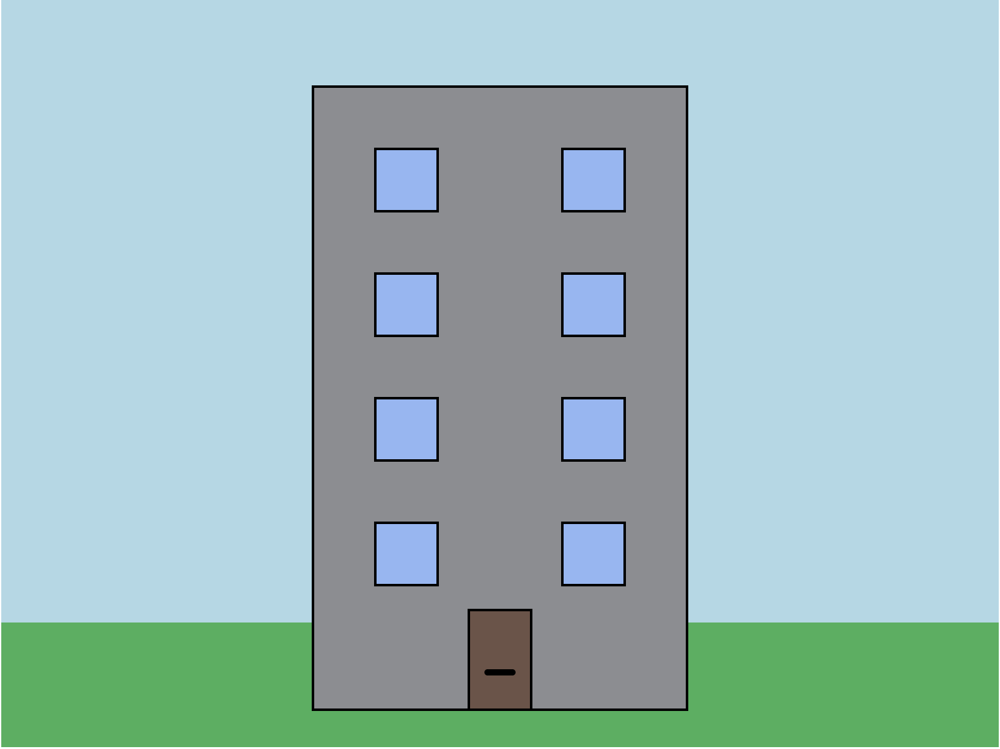
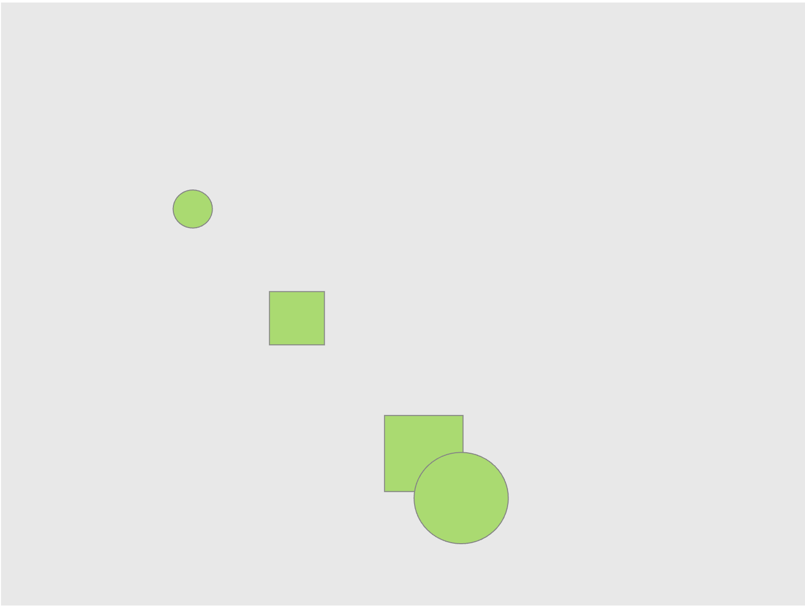

# Ilianna's Prototypes

## Drawings - Week 2

### [Prototype 1 - Standard Building](topics/prototypes/intructions-prototype1/index.html)

[Code](https://github.com/iliannaf/cart253/blob/main/topics/prototypes/intructions-prototype1/js/script.js)

### [Prototype 2 - Diglet](topics/prototypes/intructions-prototype2/index.html)

[Code](https://github.com/iliannaf/cart253/blob/main/topics/prototypes/intructions-prototype2/js/script.js)

### [Prototype 3 - Randomness](topics/prototypes/intructions-prototype3/index.html)

[Code](https://github.com/iliannaf/cart253/blob/main/topics/prototypes/intructions-prototype3/js/script.js)

---

## Week 3
