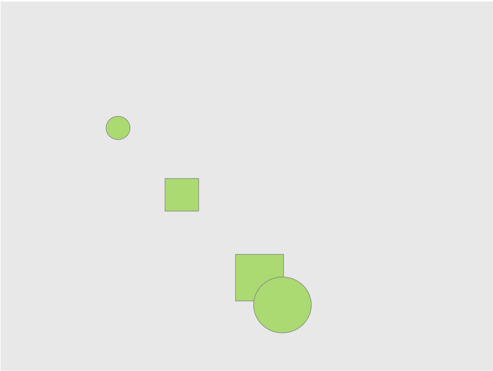

# Ilianna's Prototypes

#### - [Week 2](#week-2)
#### - [Week 3](#week-3)

## Drawings - Week 2 {#week-2}

### [Prototype 1 - Standard Building](topics/prototypes/intructions-prototype1/index.html)

[Code](https://github.com/iliannaf/cart253/blob/main/topics/prototypes/intructions-prototype1/js/script.js)

### [Prototype 2 - Diglet](topics/prototypes/intructions-prototype2/index.html)

[Code](https://github.com/iliannaf/cart253/blob/main/topics/prototypes/intructions-prototype2/js/script.js)

### [Prototype 3 - Randomness](topics/prototypes/intructions-prototype3/index.html)

[Code](https://github.com/iliannaf/cart253/blob/main/topics/prototypes/intructions-prototype3/js/script.js)

---

## Variables - Week 3 {#week-3}

### [Prototype 1 - Diglet V2](topics\prototypes\variables-prototype-1\index.html)

[Code](https://github.com/iliannaf/cart253/blob/main/topics/prototypes/variables-prototype-1/js/script.js)

### [Prototype 2 - Bouncy Ball](topics\prototypes\variables-prototype-2\index.html)

[Code](https://github.com/iliannaf/cart253/blob/main/topics/prototypes/variables-prototype-2/js/script.js)

### [Prototype 3 - Penguin Friend](topics\prototypes\variables-prototype-3\index.html)

[Code](https://github.com/iliannaf/cart253/blob/main/topics/prototypes/variables-prototype-3/js/script.js)

---

## Week 4